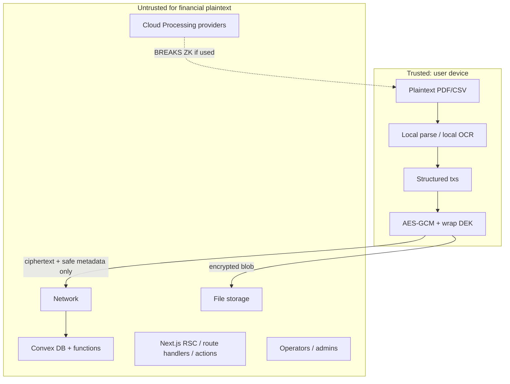

# Client-side encrypted financial storage — architecture

**Companion TODO:** [TODO-e2ee.md](./TODO-e2ee.md)  
**Phase:** 1 design (approved). Implement per TODO; stop between phases.  
**Source plan:** Cursor plan `e2ee_phase_1_architecture` (2026-03).

## Decisions locked

- **Greenfield:** New encrypted tables/fields only. Existing plaintext `transactions`, `accounts`, `statementUploads`, etc. stay as-is until a later migration phase.
- **Two modes:** **STRICT PRIVATE** (default, zero-knowledge ciphertext sync) and **Cloud Processing** (explicit opt-in; Mistral OCR / OpenRouter parse / canvas AI; **not** zero-knowledge E2EE).
- **Not messaging crypto:** No Signal / Double Ratchet / prekeys. Envelope encryption + AES-256-GCM via Web Crypto.

## Current app reality (baseline)

Today: ledger is plaintext in Convex (`convex/schema.ts`); statement import is retired; historical path sent PDFs to Mistral then OpenRouter; canvas still sends budget snapshots to OpenRouter. No client-side encryption exists.

Phase 1 does **not** change that. It defines how the **new** encrypted path must work so later phases do not paint into a corner.

---

## 1. Threat model

### Assets

- Bank/credit statement PDFs and CSV/OFX/QFX exports
- Parsed structured transactions (dates, amounts, merchants, descriptions, balances, categories that reveal spend)
- User Master Key (UMK) and Data Encryption Keys (DEKs)
- Auth session (Convex Auth JWT) — separate from encryption secrets

### Trust boundary



**Rule:** Do not call the system end-to-end encrypted / zero-knowledge if any **required** server path receives financial plaintext. Cloud Processing is a separate, labeled mode.

### Threat vs protection

| Threat | Client-side encryption protects? | Notes |
|--------|----------------------------------|--------|
| Leaked Convex DB dump | **Yes** (content) | Attacker gets ciphertext + metadata (userId, sizes, timestamps, encryptionVersion). No amounts/merchants without keys. |
| Compromised Convex function | **Yes** (content) | Function can serve/delete ciphertext; cannot decrypt without UMK/DEK. |
| Malicious DB admin | **Yes** (content) | Same as DB leak. Auth tables (email) still visible. |
| Compromised Next.js server | **Yes** if plaintext never enters RSC/route handlers/actions | Today canvas/upload APIs **do** see plaintext — those stay Cloud Processing only. STRICT path must not call them with plaintext. |
| Compromised file-storage provider | **Yes** (content) | Encrypted blobs only. Metadata: size, content-type, sha256 of ciphertext. |
| Network interception | **Partial** | TLS still required. Ciphertext alone is useless; session theft is separate. |
| Stolen auth token | **Partial** | Attacker can download **ciphertext** for that user. Cannot decrypt without device key / recovery secret. |
| Malicious browser extension / XSS same-origin | **No** | Can call Web Crypto, read decrypted UI state, exfiltrate. Non-extractable keys do not stop in-origin JS from decrypting. |
| Compromised user computer / malware | **No** | Full access to plaintext while unlocked. |
| Stolen locked device | **Partial** | Depends on OS disk encryption + whether UMK unlocked in memory / IndexedDB wrap. |
| Malicious JS from compromised deploy | **No** | Same as XSS: attacker ships decrypt + exfiltrate. |
| Loss of encryption key / recovery material | **N/A (availability)** | Ciphertext becomes permanently unreadable. Auth login alone must not restore keys. |

### Explicit non-goals of STRICT PRIVATE

- Server-side search, sum, categorize, duplicate-detect on sensitive fields
- Server-side OCR/LLM parse of statements
- Canvas AI with real merchants/amounts (that is Cloud Processing)

---

## 2. Operating modes

### STRICT PRIVATE (default — claimable as client-side encrypted / ZK for financial content)

```
PDF/CSV/OFX
  → browser FileReader
  → local parser (and local OCR if feasible in later phase)
  → structured txs in memory
  → generate DEK, AES-256-GCM encrypt file + records
  → wrap DEK with key derived from UMK
  → Convex mutations receive ciphertext + safe metadata only
```

Plaintext lifetime: only in browser memory (and optionally ephemeral Worker) until encrypt completes; then discard.

### Cloud Processing (opt-in — **not** zero-knowledge E2EE)

```
PDF
  → user explicit consent UI
  → trusted processing (e.g. Mistral OCR, OpenRouter parse, canvas OpenRouter)
  → plaintext temporarily visible to provider + Next route
  → results returned to client
  → client encrypts results before Convex write (if storing in encrypted tables)
```

Label in product and docs: **Cloud Processing Mode is not end-to-end encrypted.** Logging, retention, and provider contracts are separate risk acceptance.

Existing canvas route (`src/app/api/canvas/chat/route.ts`) and retired Mistral/OpenRouter import path are Cloud Processing by definition.

---

## 3. Cryptographic architecture

### Primitives (platform only — no hand-rolled crypto)

| Purpose | Choice |
|---------|--------|
| Content AEAD | **AES-256-GCM** via Web Crypto `SubtleCrypto` |
| Randomness | `crypto.getRandomValues` |
| Key wrap | **AES-KW** (or AES-GCM wrap of DEK) via `wrapKey` / `unwrapKey` |
| KDF for password path (Phase 2) | **Argon2id** via established Wasm lib (Web Crypto has no Argon2) |
| Domain separation | **HKDF-SHA-256** from UMK → wrap-key / purpose keys |
| Integrity of public metadata | Prefer AAD over separate HMAC where possible |

**Why not libsodium/NaCl as primary:** Web Crypto is built-in, audited by browsers, no extra supply chain for the hot path. Optional later: libsodium only if a construction Web Crypto lacks is required (e.g. sealed-box device linking). Prefer Web Crypto first.

**Why not password-as-AES-key:** Password → Argon2id → Key Encryption Key (KEK) → wrap UMK. Never use password bytes directly as AES key.

### Envelope encryption (chosen pattern)

```
UMK (256-bit random, client-generated)
  │
  ├─ HKDF → Wrap Key (purpose: "dek-wrap-v1")
  │
  └─ per object: random DEK (AES-256)
        │
        ├─ encrypt payload with DEK + unique 96-bit IV (AES-GCM)
        └─ wrap DEK with Wrap Key → store wrapped DEK beside ciphertext
```

**Why wrap DEKs (not HKDF-derive one key per record from UMK alone):**

- Per-document/statement DEK supports efficient re-wrap on key rotation without re-encrypting huge blobs until desired
- Limits blast radius of a single DEK compromise (one statement/file)
- Standard envelope pattern (keys stay client-side)

HKDF is used for **purpose separation** from UMK, not as the sole per-record content key.

### Encryption envelope (versioned)

Conceptual TypeScript shape (exact fields finalized in Phase 3):

```ts
type EncryptedEnvelopeV1 = {
  v: 1;
  alg: "AES-256-GCM";
  keyId: string; // which UMK/wrap-key version
  dekWrapped: ArrayBuffer; // wrapped DEK
  iv: ArrayBuffer; // 12 bytes
  aad?: ArrayBuffer; // optional; prefer recompute from canonical fields
  ciphertext: ArrayBuffer;
};
```

**AAD (Additional Authenticated Data):** bind immutable identity so ciphertext cannot be swapped across rows.

Include in AAD (canonical encoding):

- `v` (envelope version)
- `userId` (Convex user id string)
- `recordId` (app-stable id, not mutable fields)
- `kind` (`document` | `tx_batch` | `tx` | `account_meta`)
- `keyId`

Do **not** put mutable fields (category edits, tags) in AAD — those live inside ciphertext or force re-encrypt on change.

### Storage encoding on Convex

| Payload size | Store |
|--------------|--------|
| Wrapped DEK, IV, small envelopes (&lt; ~800KB safe margin under 1MB doc limit) | `v.bytes()` (`ArrayBuffer`) on document |
| Original PDF / large ciphertext | Convex **file storage** (`Id<"_storage">`) + metadata doc with wrapped DEK / IV / AAD inputs |

Avoid base64 in DB. Use `ArrayBuffer` / `v.bytes()`. Upload encrypted files as `application/octet-stream` via `generateUploadUrl` (auth in that mutation). Prefer HTTP action or short-lived controlled fetch for download ACL — `getUrl()` bearer URLs are shareable until file delete.

---

## 4. Key architecture and recovery (design only — implement Phase 2)

### Separation

| System | Purpose | Convex may hold |
|--------|---------|-----------------|
| Auth (Convex Auth password/session) | Prove account ownership | password verifier / session |
| Encryption | Confidentiality of financial data | **wrapped** UMK only, never plaintext UMK |

Login ≠ decrypt. Unlock encryption is a second step (or same password locally derived, never sending KEK/UMK).

### Recovery options (evaluate in Phase 2; architecture reserves all)

1. **Recovery key (high entropy, shown once)** — wrap UMK; user stores offline. Best availability if password forgotten. Usability: user must save it.
2. **Password-derived KEK (Argon2id)** — wrap UMK; UX familiar. Weak passwords = offline attack on wrapped blob if DB leaks.
3. **WebAuthn/passkey** — wrap or unlock via PRF/extension where available; strong phishing resistance; platform support uneven.
4. **Multi-device** — device A encrypts UMK to device B’s public key (or QR ECDH); Convex stores only wrapped packages. No plaintext UMK transit.

**Never** upload plaintext UMK. Wrapped UMK blobs in Convex are OK (still ciphertext w.r.t. operators).

### Key versioning (from day one)

- `keyId` on every envelope
- New data uses current key
- Old envelopes remain decryptable with old wrapped keys until local re-encrypt job (Phase 13)

---

## 5. Document processing paths

| Input | STRICT PRIVATE | Cloud Processing |
|-------|----------------|------------------|
| Text PDF | Local text extract (e.g. pdf.js) → parse | Optional: send PDF to OCR/LLM |
| Scanned PDF | Local OCR only if Wasm OCR proven viable (Phase 7); else **block** or force explicit Cloud mode | Mistral OCR (plaintext to provider) |
| CSV / OFX / QFX | Local parse always | Not needed |
| Structured JSON export | Local parse | Not needed |

**Do not** silently OCR in the cloud. UI must name the mode and consequence.

Reuse existing domain knowledge later (e.g. `src/domains/bank-history/domain/parseCibcCsv.ts`, `src/domains/statements/domain/parsedStatement.ts`) but move parse entrypoints to **client** modules under STRICT path.

---

## 6. Parsed data granularity (recommendation)

**Chosen: statement-scoped DEK + per-transaction ciphertext rows.**

| Approach | Pros | Cons |
|----------|------|------|
| One blob per statement | Few wraps; simple | Rewrite whole blob to edit one tx; large download for one change |
| Per-tx DEK | Fine isolation | Wrap overhead; rotation pain |
| **Statement DEK, each tx its own AES-GCM ciphertext, same wrapped DEK stored once on statement (or duplicated small wrap per row)** | Sync/delete/update one tx; local filter still decrypt set; one DEK wrap per import | Statement DEK compromise exposes that statement’s txs |

Practical Convex shape (greenfield — names indicative):

```
encryptedDocuments: {
  userId, documentId, storageId, /* wrapped DEK, iv, keyId, v, alg */,
  contentType, byteLength, createdAt
  // NO filename if it reveals bank; or encrypt filename inside envelope
}

encryptedTxRecords: {
  userId, recordId, documentId?, accountRef?, /* opaque */
  keyId, v, iv, ciphertext /* bytes */, createdAt, updatedAt
  // optional non-sensitive: schemaVersion only
}
```

**Minimize metadata:** Prefer opaque `accountRef` (client-random id) over bank name/mask. Avoid storing merchant, amount, date as plaintext columns for “convenient” indexes — that defeats the model.

**Batch alternative:** For very large imports, encrypt a chunk of N transactions per envelope to cut row count; Phase 9 can tune N after load tests. Default design assumes **one tx per row** for update granularity.

Client load model:

```
Convex ciphertext pages
  → browser decrypt in Worker
  → in-memory indexes (Map/filter)
  → UI
```

Reasonable scale for personal finance: tens of thousands of txs in memory after decrypt is usually fine; millions need paging + local IndexedDB ciphertext cache (Phase 10).

### Search / aggregate

Convex **cannot** filter by merchant/amount on STRICT data. All sensitive query/aggregate runs **after** local decrypt. No deterministic hashes of merchants/amounts without documenting frequency-analysis leakage — **default: do not**.

Privacy-preserving server indexes (blind indexes, OPE, etc.) are **out of Phase 1 scope**; if ever added, document leakage explicitly and keep opt-in.

---

## 7. Next.js and Convex boundaries

### Must stay `"use client"` / Web Worker (STRICT)

- Key gen, derive, wrap, encrypt, decrypt
- File read, parse, OCR, normalize, local calculate
- Decrypted React state

### Must never receive STRICT plaintext or keys

- RSC, Server Actions, route handlers, middleware
- Convex queries/mutations/actions (payload = ciphertext + safe metadata)
- Logs, analytics, error reporters, URL query params

### Module layout (recommended; adjust in later phases)

```
src/crypto/          # Web Crypto only; no Node crypto in client path
  types.ts           # envelope, keyId, AAD codec
  masterKey.ts
  deriveKey.ts
  wrapKey.ts
  encrypt.ts
  decrypt.ts
  storage.ts         # IndexedDB key material (wrapped)

src/financial/       # local parse + local math
src/documents/       # encrypt/decrypt document bytes (+ chunking later)
src/storage/         # client APIs that call Convex with ciphertext only

convex/
  encryptedDocuments.ts
  encryptedRecords.ts
  schema.ts          # additive greenfield tables
```

Do **not** put decrypt helpers in `src/app/api/**`.

---

## 8. Browser key storage (Phase 2 detail; constraints now)

- Prefer **IndexedDB** holding **wrapped** UMK / non-extractable unwrapped session keys in memory
- **Non-extractable** `CryptoKey` for active DEK/UMK use after unwrap
- Never plaintext keys in `localStorage` / `sessionStorage` / cookies / Convex / URLs
- Limitation (must stay in threat model): same-origin XSS can still `decrypt()` and steal plaintext

---

## 9. Web application security (requirements for later phases)

- Strict CSP; minimize third-party scripts
- Trusted Types where practical
- Safe PDF rendering (no reckless `eval` of PDF JS); MIME + size limits; treat PDFs as untrusted
- Dependency pinning / audit; secure deploy (protect against malicious JS delivery — outside E2EE)
- No sensitive payloads to analytics, Sentry-like tools, or AI without explicit Cloud Processing consent

---

## 10. AI

Any path that sends decrypted txs/statements to an AI API is **Cloud Processing**. Alternatives for later: local models, redaction, user opt-in, derived aggregates only. Do not auto-send.

---

## 11. Authorization still required

Encryption ≠ access control. Convex must `requireUser` and scope by `userId` so users only read **their** ciphertext. Stolen token still downloads victim ciphertext (useless without keys, but DoS/privacy-of-existence remains).

Unavoidable metadata leakage: userId, record existence, ciphertext length, timestamps, keyId, encryption version, storage object size/sha256 of ciphertext.

---

## 12. Integrity and chunked files (design)

- AES-GCM provides confidentiality + authenticity of ciphertext
- AAD binds record identity
- Large files (Phase 8): use an **established** chunked AEAD construction (e.g. documented STREAM-style or library that implements chunked AES-GCM with chunk index in AAD and unique IVs per chunk). Do not invent ad hoc chunk protocols casually — specify library choice in Phase 8 after docs review.

---

## 13. Multi-device, rotation, backups (architecture stubs)

- Multi-device: encrypted key package or QR ECDH; Convex stores wrapped packages only (Phase 11)
- Rotation: new `keyId`; dual-decrypt; background local re-encrypt (Phase 13)
- Backups: DB/storage export = ciphertext only; recovery needs user secret (Phase 12)

---

## 14. Testing strategy

Later phases implement:

- Encrypt/decrypt roundtrip; wrong key; bit-flip ciphertext; AAD mismatch; unique IV; wrap/unwrap; file + tx paths; rotation; recovery
- **Contract tests:** mock Convex client asserts outbound mutation args contain no plaintext field names/values from fixtures

Phase 1 deliverable: this architecture + TypeScript **type contracts** only (no real encrypt yet) — see [TODO-e2ee.md](./TODO-e2ee.md).

---

## 15. Phase 1 plaintext inventory (STRICT path target)

| Location | Plaintext? | Duration |
|----------|------------|----------|
| User disk before pick | Yes (their file) | Until they delete |
| Browser memory during parse/encrypt | Yes | Seconds–minutes |
| Network STRICT | No | — |
| Convex STRICT | No (ciphertext + metadata) | Persistent |
| Next.js STRICT | No | — |
| Cloud Processing path | Yes at provider + Next | Per provider retention |

### What weakens the privacy model

- Cloud Processing (any)
- Rich plaintext metadata columns “for indexing”
- Deterministic merchant hashes
- Bearer `getUrl()` sharing for encrypted files
- XSS / malicious deploy / malware
- Weak recovery password if wrapped UMK stored in Convex
- Existing plaintext tables remaining until migration
